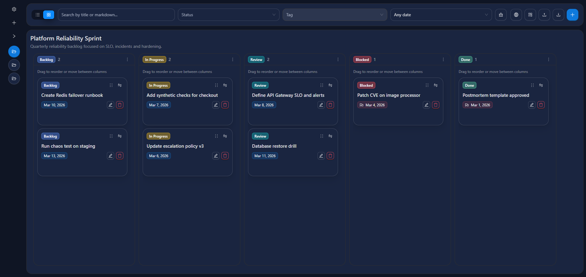

# 📋 Task Operations Board

<p align="center">
  
  
  
  
  
  
  
</p>

<p align="center">
  Local-first React dashboard for projects, tasks and Kanban workflows, with dark mode by default, accent color customization, markdown editing, drag and drop, JSON import/export and bilingual UI.
</p>

<p align="center">
  
</p>

## 🏷️ Tags

`react` `typescript` `vite` `antd` `zustand` `kanban` `task-management` `project-management` `i18n` `markdown` `local-first`

## ✨ Why this project exists

This project is a frontend-only productivity workspace designed to manage multiple projects and their tasks without requiring a backend. It focuses on a pragmatic developer experience:

- fast local setup
- structured React architecture
- persistent client-side state
- responsive Kanban and list workflows
- English and Italian localization
- product-oriented UI with theming support

## 🚀 Core capabilities

- Multi-project workspace with project-specific statuses and task collections
- Dual task visualization: `Kanban` and `List`
- Task CRUD with title, markdown content, tags, due date and status assignment
- Drag and drop reordering across columns
- Search and filtering by text, status, tag and due-date window
- Light and dark mode support with a single configurable accent color
- Local persistence through `localStorage`
- Full snapshot import/export in JSON format
- Real-time markdown editing and preview
- Built-in English and Italian localization powered by JSON resources

## 🎨 UI and product direction

The current experience is intentionally centered around a dark-first operational dashboard:

- dark mode is the default visual baseline
- the user can switch between `dark` and `light`
- theme personalization is limited to one accent color to keep the model simple
- semantic colors such as success, warning and error stay internal to the design system

## 🧱 Tech stack

| Area          | Choice                      |
| ------------- | --------------------------- |
| Build tool    | Vite                        |
| UI            | React 19 + Ant Design 6     |
| Language      | TypeScript                  |
| State         | Zustand                     |
| Validation    | React Hook Form + Zod       |
| Drag and drop | dnd-kit                     |
| Markdown      | react-markdown + remark-gfm |
| Dates         | dayjs                       |
| Localization  | i18next + react-i18next     |
| Formatting    | Prettier                    |
| Linting       | ESLint                      |

## 🗂️ Project structure

```text
src/
  app/                   application shell, providers, layout orchestration
  features/projects/     project domain components and forms
  features/tasks/        task domain, drawers, cards, schemas
  features/kanban/       kanban board and column behaviors
  shared/                i18n, theme helpers, defaults, utilities
  store/                 Zustand store, snapshot schema, persistence logic
assets/
  screen.png             product screenshot used in this README
.github/workflows/
  ci.yml                 validation pipeline
  deploy-pages.yml       GitHub Pages deployment pipeline
scripts/
  set-version.js         automatic semver bump from conventional commits
```

## 🧠 Architectural notes

The codebase was structured to avoid a monolithic page component and to keep responsibilities explicit:

- `app/` coordinates layout composition, dialogs and screen-level orchestration
- `features/` groups domain-specific UI and logic by bounded area
- `shared/` contains reusable utilities, localization resources and theme helpers
- `store/` centralizes state transitions, persistence and snapshot normalization

This keeps the project easier to extend when adding:

- new task fields
- extra filters
- alternate views
- release automation
- more languages

## 🌍 Localization

Localization is implemented through JSON-based translation resources:

- `src/shared/i18n/locales/en.json`
- `src/shared/i18n/locales/it.json`

The application supports:

- English
- Italian

Mocked content and UI copy are aligned with the active language where relevant.

## 💾 Persistence model

The application saves its state locally in the browser under:

- `task-dashboard-v1`

The persisted snapshot includes:

- projects
- statuses
- tasks
- filters
- language
- theme mode
- accent color

Import and export work on the full snapshot, which makes the project easy to demo, migrate or reset.

## ⚙️ Getting started

### Requirements

- Node.js 20+
- npm

### Install

```bash
npm install
```

### Start the development server

```bash
npm run dev
```

### Preview the production bundle locally

```bash
npm run preview
```

## 🧪 Quality commands

| Command                | Purpose                                             |
| ---------------------- | --------------------------------------------------- |
| `npm run lint`         | Runs ESLint on the codebase                         |
| `npm run format`       | Formats the repository with Prettier                |
| `npm run format:check` | Verifies formatting without changing files          |
| `npm run build`        | Executes TypeScript build and Vite production build |

## 🔁 Release and versioning

Versioning is automated through:

- `npm run set:version`

The release script:

- computes the next semantic version from conventional commits
- updates `package.json`
- updates version references in `README.md`
- updates `APP_VERSION` values in `env/.env*` files when present
- stages changes and creates a release commit

This means the repository expects commit hygiene based on Conventional Commits.

## 🛠️ Automation

GitHub Actions are already configured for:

- CI validation
- GitHub Pages deployment

Relevant workflow files:

- `.github/workflows/ci.yml`
- `.github/workflows/deploy-pages.yml`

## 📦 Available npm scripts

```bash
npm run dev
npm run build
npm run lint
npm run preview
npm run format
npm run format:check
npm run set:version
```

## 🔒 Scope and limitations

This repository is intentionally frontend-only.

That means:

- no backend
- no authentication
- no multi-user sync
- no server-side storage

It is best suited for:

- prototypes
- local demos
- UX exploration
- component architecture exercises
- frontend-first operational dashboards

## 📄 License

Released under the MIT License. See `LICENSE` for details.
